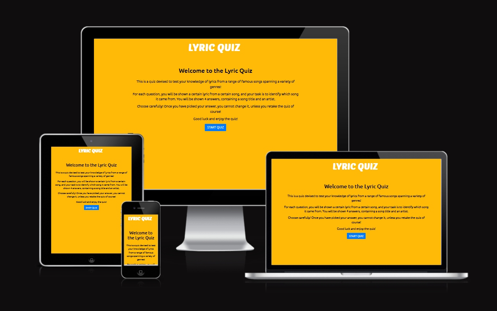
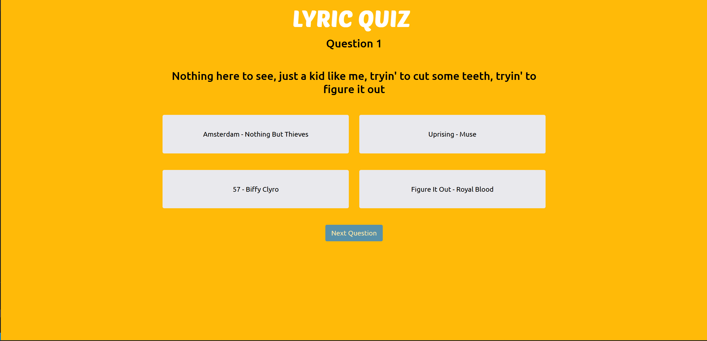

# Milestone Project 2 - Lyric Quiz



## Live Site

The live site for this project can be found at this link: https://99bjacko.github.io/milestone-project-2/

## GitHub Repository

The GitHub Repository for this project can be found at this link: <https://github.com/99bjacko/milestone-project-2>

## Objective

In this project, I intend to create an engaging and responsive game. The aim of the game is to guess which song the shown lyric is from. The goal of this website is to further share my passion for music, creating questions around some of my favourite music. The main objective is to demonstrate my capabilities in JavaScript, HTML and CSS, creating a fun experience for those who play the game.

The target audience for this website is for anyone who enjoys listening to music and wants to put their knowledge to the test in this game!

# UX

### User Stories

- As a visitor to the website, I want the navigation between pages or areas to be easy and intuitive, not having to rely on browser buttons.
- As a visitor to the website, I want the website to be responsive on a number of different devices.
- As a first time visitor to the website, I want to be shown some information about how to play the game upon opening the website.
- As a first time visitor to the website, I want to play an entertaining, interactive quiz that will keep me engaged for the whole duration.
- As a first time visitor to the website, I want to be able to test my knowledge of popular songs.
- As a first time visitor to the website, I want to be challenged by the quiz, but also the quiz should not be too difficult.
- As a returning visitor to the website, I want to expand my knowledge about different songs
- As a returning visitor to the website, I want to be asked a variety of questions, not the same questions each time.

### Opportunites

Derived from user stories
| Opportunities | Importance | Viability / Feasibility |
| ------------- | ---------- | ----------------------- |
|Easy and intuitive navigation between pages or areas | 5 | 5 |
|Responsible site suitable for mobile, tablet and desktop screen sizes | 5 | 5 |
|Provide information about the quiz and how to play it | 5 | 5 |
|Illustrate my passion for music of different genres | 5 | 5 |
|Share some of my favourite songs | 5 | 5 |
|Entertaining and interactive quiz game that keeps users engaged | 5 | 5 |
|Entertaining and interactive quiz game that is challenging enough but not overly difficult | 5 | 5 |
|Entertaining and interactive quiz game that has a variety of questions that change each time the game is played | 5 | 4 |

### Initial Concept

A simple design with clear focus on the functionality of the game is key for this website. The design should be kept free from distractions as unnecessary clutter would take focus from the game itself. Using a colour scheme that is eye-catching yet with sufficient contrast to ensure all content is sufficiently readable. Only the relevant information will be shown - for example, when the game is in progress, the information about how to play it and also the results screen will be hidden. This will assist in keeping the design as streamlined as possible, avoiding potential confusion.

#### Wireframes

For initially designing the project, I utilised Balsamiq to produce wireframes. This step allows for planning how things will be laid out, allowing to focus more on getting it to look right and the functionality of the website instead of trying to simultaneously code and design.

- [Welcome Area Wireframe](./docs/wireframes/welcome_wireframe.png)
- [Game Area Wireframe](./docs/wireframes/game_wireframe.png)
- [Results Area Wireframe](./docs/wireframes/results_wireframe.png)

#### Colour Scheme

The colour scheme for this project ended up being something I debated quite a bit. I considered having a background image, but I couldn't find something that suited this project completely, without sacrificing on some of the key factors stated in the initial concept section. In the end, I settled on a very simple colour scheme, sticking with a solid yellow (#ffba08) background, with a white logo, black text and a mixture of Bootstrap's default and primary button styles. The end result is something that despite being simple, is still stylish and sufficiently contrasted.

#### Typography

The typography for this project was picked by browsing the google fonts website until I found something that really stood out to me. 

For the text logo, I wanted something that was more abstract and different to many of the more 'normal' typefaces. I ended up settling on the Poetsen One typeface, which appears more curved than many other typefaces and it stood out to me immediately. Using a heavier font weight, I was able to achieve the look I was going for.

The typeface Ubuntu was used for the rest of the website.

## Features

### Common Features

- Logo

    - The lyric quiz logo is present at all times on this website, acting as a home button which can be clicked before, during or after the quiz.
    - The logo contributes to easy and intuitive navigation, thus satisfying the first user story.
    
    

    

- Call to Action Button
    
    - Each container of this website has one single call to action button relevant to which container it is in.
    - The description container has a start quiz button.
    - The game container has a next question button, which is disabled at first and then enabled when a user chooses an answer.
    - The results container has a play again button.
    - These buttons are key in providing easy and intuitive navigation to the user, satisfying the first user story.

    

    

    

    

### Description Container


- The description container is the landing page of the website, featuring a simple yet effective design.

- The description container features a heading, a few paragraphs containing information about the quiz as well as the start quiz button.

- The description container satisfies the second user story as it is responsive and looks appealing on multiple devices with varying screen sizes.

- The description container also satisfies the third user story as it provides some insight on how to play the game before starting.

### Game Container



- The game container is displayed when the user clicks the start button and features the current question number, a lyric from a song, and 4 answer buttons containing a song title paired with an artist.

- The question displayed is picked from a predetermined list of questions and answers. The list is randomised before playing the quiz.

- The next question button is disabled by default, forcing players to pick an answer before progressing.


- After choosing an answer by clicking on the corresponding button, the answer buttons are disabled and the next question button is enabled.

- The chosen answer is clearly identified by the gray background and white text colour.

- The game container satisfies user stories 4, 5, 6, 7, and 8 as it provides a quiz that is entertaining and interactive, allows users to test their knowledge of popular songs, challenges users whilst not being too difficult, encourages users to expand their knowledge about different songs, and asks users a variety of questions in a different order enabling replayablity which would not be possible with a set order of questions.

- The game container also satisfies the second user story as it is responsive and looks appealing on multiple devices with varying screen sizes. On smaller screen sizes, the buttons which are in rows of two on larger screens, are now stacked on top of each other as well as slightly smaller. This can be seen below.


### Results Container


 - After answering 10 questions, the game will end and the results container will be displayed.

 - The results container displays the user's score out of 10, a message based on the score and a play again button which will go back to the start and disaply the description container.

 - The results container satisfies the second user story as it is responsive and looks appealing on multiple devices with varying screen sizes.

All opportunities derived from user stories have been achieved as detailed above.

### Features to Implement

Despite being mostly happy with my project, I believe that there are ways that it can be improved by implementing some additional features and tweaks.

- Design Adjustments

    - The website could be made even more aesthetically pleasing by making some tweaks to the overall design.
    - I would like the website to have a custom simple background image, whilst still maintaining the contrast and readability. I believe that this would contribute positively towards the overall experience and make the website more enjoyable to engage with.
    - Some additional small changes could be made, such as refining the style of the answer buttons.

- Functionality Adjustments

    - Some additions to the functionality of the quiz could be made to make the user experience better and make the quiz itself even more engaging.
    - Incorrect answers could be randomly selected for each question, meaning even if it is the same lyric and the same correct answer, the other answers could be different to when previously answering that same question.
    - Implementing a restart button, which restarts the quiz from question 1, instead of having to go back to the main area and hitting the start button again.
    - More topics could be added for variety and to make sure that if the user is not a big music fan, they can still be engaged by this website.

- Other Suggestions

    - Spotify integration could be added to this website, allowing users to explore new music after playing the quiz.

## Technologies Used

### Languages Used

- [HTML5](https://en.wikipedia.org/wiki/HTML5)
- [CSS3](https://en.wikipedia.org/wiki/CSS)
- [JavaScript (including Bootstrap)](https://en.wikipedia.org/wiki/JavaScript)

### Frameworks, Libraries, Programmes and Tools Used

## Testing

### Lighthouse Testing

#### Desktop Testing

#### Mobile Testing

### Manual Testing

## Deployment

The site was deployed to GitHub pages. The steps to deploy are as follows:

1. Log in to GitHub
2. Navigate to the GitHub repository for this project, milestone-project-2
3. In the repository, navigate to the *Settings* tab
4. Select the pages link from the menu on the left hand side
5. Under the Build and deployment heading, make sure the source selected is *Deploy from a branch*
6. In the branch section, select the *Main* branch from the drop-down menu and click Save
7. A message will be displayed to indicate a successful deployment to GitHub pages and a live link will appear

You can find the live site at this link: <https://99bjacko.github.io/milestone-project-2/>

### Forking the GitHub Repository

Forking the GitHub repository allows a copy of the original repository to be made without affecting the original repository. This can be achieved by following these steps:

1. Log in to GitHub
2. Navigate to the GitHub repository for this project, milestone-project-2
3. Click the Fork button in the top right corner

### Making a Local Clone

1. Log in to GitHub
2. Navigate to the GitHub repository for this project, milestone-project-2
3. To clone the repository using HTTPS, copy the link under "Clone with HTTPS"
4. Open a GitBash terminal and navigate to the location you want to use for the cloned directory
5. Use the git clone command with the URL copied in Step 3

```
$ git clone https://github.com/99bjacko/milestone-project-1.git
```
7. Press enter and your local clone will be created

## Credits

### Code
- The code used for randomising the questions was the [Durstenfeld shuffle](https://stackoverflow.com/a/12646864)
### Content

### Media

### Acknowledgements